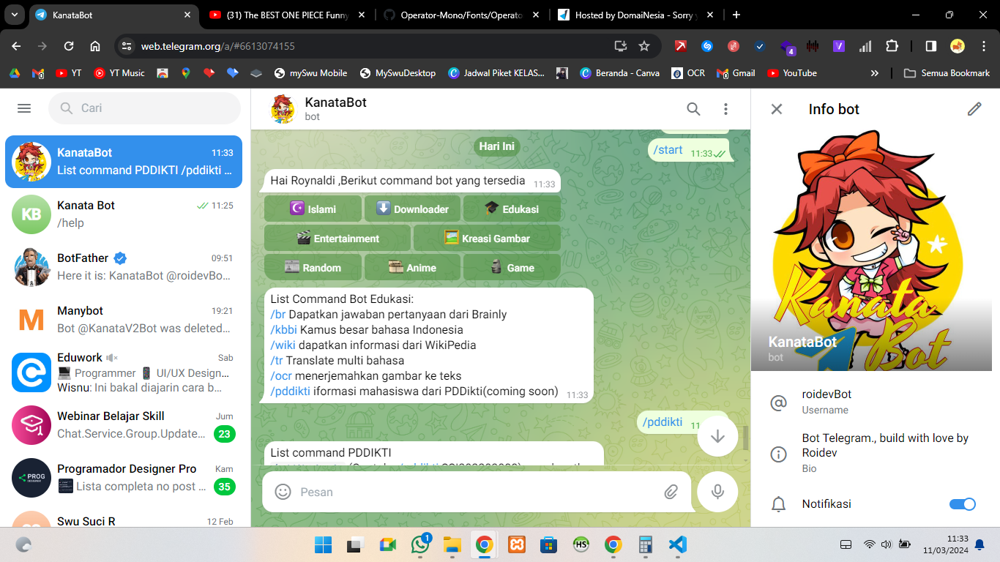

Screenshoot Telegram



### 1. Prerequesites :
- Nodejs v18 keatas
 - ngrok.exe(buat forward self server sebagai hook)

### 2. Cara installasi

```bash
npm install 
```

untuk membuat bot dan mendapatkan APIkey/token,silahkan kunjungi link berikut [BotFather](https://t.me/BotFather)
untuk mendownload dan menggunakan ngrok silahkan kunjungi web berikut [Ngrok](https://ngrok.com/) 

buat file baru bernama `.env` lalu isikan kode berikut
```env
TOKEN_BOT='isi dengan token milikmu mis : 62xxx' 
URL_HOOK='isi dengan url hook milikmu'
PORT =
```